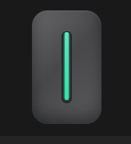
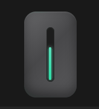
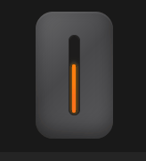
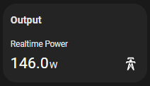
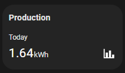
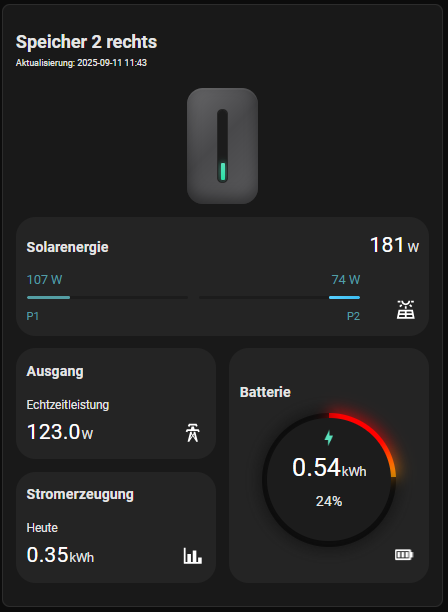

# B2500D-Card

Eine Home Assistand Custom Card für den Marstek B2500d Speicher.

<u>Große Karte:</u>


<u>Kompakte Karte:</u>


## 🚀 Features
Angelehnt an die Marstek App, zeigt diese Custom Card die Werte deines B2500d Speichers an.

### 💡 Status Visualisierung

Die Karte visualisiert oben als erstes den aktuellen Lade/Entladestatus.
Status zeigt ebenfalls aktuellen Batterieladestand in %.

| Status     | Bedeutung                          |
|--------|------------------------------------|
|   | Batterie wird weder ge- noch entladen.              |
|     | Batterie wird geladen (Solarenergie vorhanden und größer als Ausgangsleistung. Batterie nicht voll) |
|      | Batterie wird entladen (Ausgangsleistung größer Eingangsleistung. Batterie größer 0%)      |


### Karten

Aktuell können folgende Werte bzw. Karten angezeigt werden: 

#### Große Karte

1. Aktuelle Solarenergie gesamt und Eingang 1 & Eingang 2
   


2. Aktuelle Ausgangsleistung gesamt



3. Batterie Ladestand / Kapazität


4. Tages Stromerzeugung



Aktuell können folgende Modi eingestellt/umgestellt bzw. angezeigt werden

1. Lademodus (gleichzeitiges laden/entladen vs. vollständig laden und dann entladen)
2. Entlademodus (auto/manuell)
3. Überschusseinspeisung (an/aus)


Wobei jede dieser einzelnen Karten auch optional ausgeblendet werden können, siehe Abschnitt Parameter

#### Kompakte Karte
Diese Karte lässt sich nicht anpassen


## ⚙️ Installation

### Abhängigkeiten
Die b2500d-card verwendet man am einfachsten mit einem Gerät was von folgendem Addon stammt:

- [hm2mqtt by tomquist](https://github.com/tomquist/hm2mqtt)

So kann man einfach das ganze Device übergeben. Die Card nutzt die Standard Entities. Wurden die Entitäten umbenannt funktioniert dieser einfache Weg nicht mehr.


### HACS
####  Benutzerdefinierte Repositories
1. HACS öffnen
2. Frontend → oben rechts auf die drei Punkte → Custom Repositories / Benutzerdefinierte Repositories → `Neisi/b2500d-card`
3. Typ Dashboard
4. Installieren
#### Community Store
Kommt hoffentlich bald :-)

### Manuelle Installation ohne HACS
1. `b2500d-card.js` nach `/config/www/` kopieren
2. In Lovelace hinzufügen:
```yaml
resources:
  - url: /local/b2500d-card.js
    type: module
```
### 🛠️ Parameter

Hier sind die verfügbaren Parameter für diese Lovelace Card beschrieben.

### 🔒 Erforderliche Parameter

| Name         | Typ      | Beschreibung                              |
|--------------|----------|-------------------------------------------|
| `device`     | string   | Der Name deines Geräts. Heißt z.B. der Sensor für die aktuelle Batterie "sensor.speicher_1_links_battery_percentage" ist <speicher_1_links> der Name des Geräts. |


### 🧩 Optionale Parameter

| Name           | Typ      | Beschreibung                                               | Standardwert     |
|----------------|----------|------------------------------------------------------------|------------------|
| `name`        | string   | Wie heißt dein Speicher ? Der Name wird oben links in der Karte angezeigt        | Std. Gerätename (also z.B. "speicher_1_links"            |
| `output`    | boolean  | Legt fest, ob die Karte Ausgangsleistung angezeigt werden soll            | `true`           |
| `battery`         | boolean   | Legt fest, ob die Karte Batterie angezeigt werden soll                            | `true`|
| `production`         | boolean   | Legt fest, ob die Karte Stromerzeugung angezeigt werden soll            | `true`      |
| `settings`        | boolean   | Legt fest, ob die Karte Einstellungen angezeigt werden soll              | `true`|
| `solar`        | boolean   | Legt fest, ob die Karte Solarenergie angezeigt werden soll             | `true`|
| `compact`        | boolean   | Zeigt die kompakte Variante an             | `false`|

### 📘 Beispielkonfiguration
Füge die komplette Karte ganz einfach in dein Dashboard ein
```yaml
type: custom:b2500d-card
device: speicher_1_links
name: Speicher 1 links
```

Karte Einstellungen ausblenden:
```yaml
type: custom:b2500d-card
device: speicher_1_links
name: Speicher 1 links
settings: false
```


Zeigt nur die Karte Solarenergie an:
```yaml
type: custom:b2500d-card
device: speicher_1_links
name: Speicher 1 links
settings: false
output: false
production: false
battery: false
```


Zeigt nur die Status Karte an:
```yaml
type: custom:b2500d-card
device: speicher_1_links
name: Speicher 1 links
settings: false
output: false
production: false
battery: false
solar: false
```


Zeigt die kompakte Karte an:
```yaml
type: custom:b2500d-card
device: speicher_1_links
name: Speicher 1 links
compact: true
```


